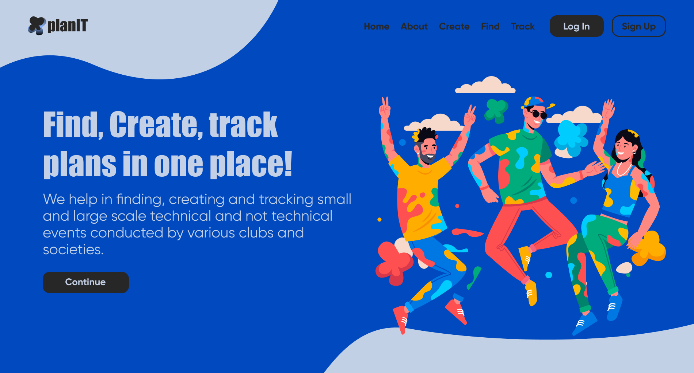
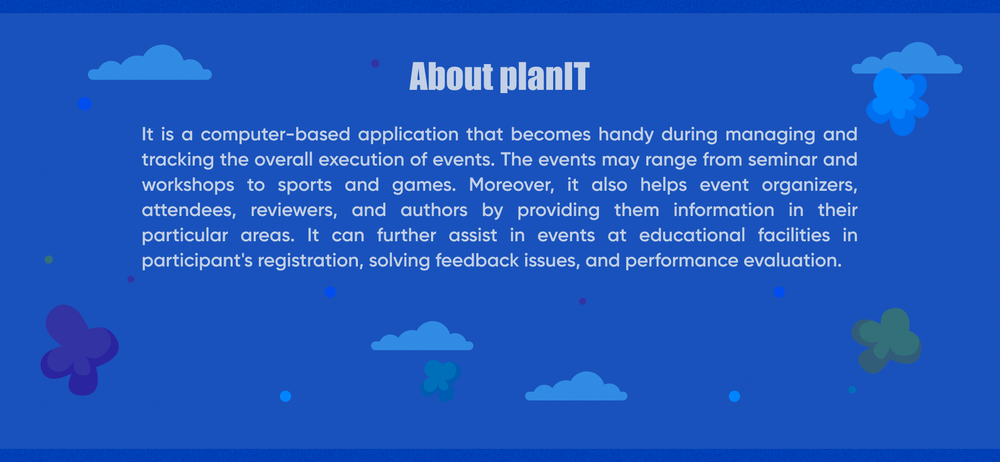
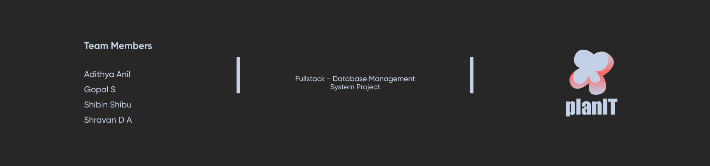

# PlanIT
<b>PlanIT is an event management system.</b>

<b>Stacks Used</b>

<ul>
  <b>Frontend</b>
  <li>HTML</li>
  <li>CSS</li>
  <li>JS</li>
   
  <b>Backend</b> 
  <li>Node JS</li>
  <li>mongoDB</li>
   
  <b>UI Design</b>
  <li>Figma</li>
</ul>

<b>Team Members</b>

<ul>
  <li><b><a href="https://github.com/unidreamerzz007">Adithya Anil</a></b></li>
  <li><b><a href="https://github.com/gopalshibu142">Gopal S</a></b></li>
  <li><b><a href="https://shibinshibu01.bio.link/">Shibin Shibu</a></b></li>
  <li><b><a href="https://www.linkedin.com/in/shrvn8704/">Shravan D A</a></b></li>
</ul>
